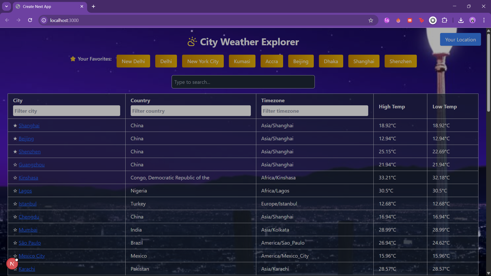
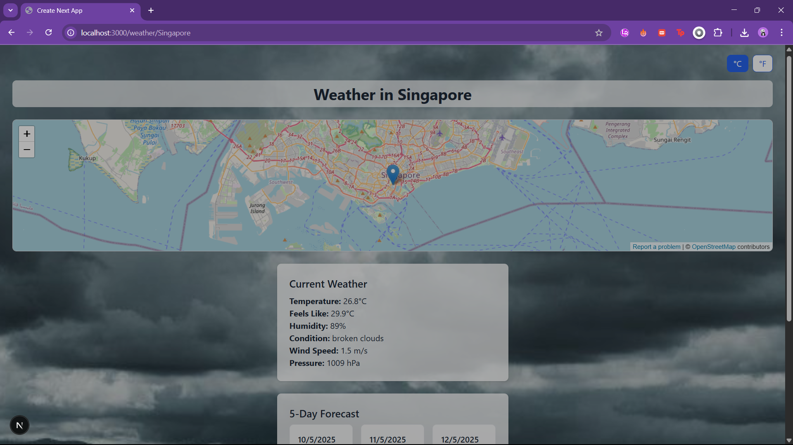
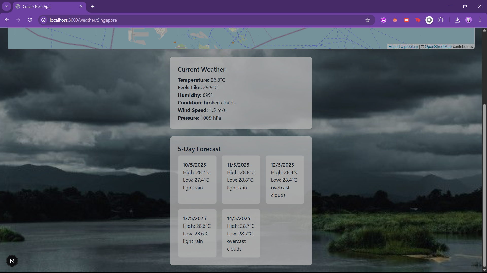

# 🌤️ City Weather Explorer

City Weather Explorer is a sleek and intuitive web application that brings you real-time weather information from around the globe. Built with cutting-edge technologies like **Next.js 14**, **TypeScript**, and beautifully styled with **Tailwind CSS**, it offers a seamless and responsive experience across all your devices. Discover current weather conditions, plan your week with a detailed 5-day forecast, and even explore the weather in your immediate vicinity with geolocation support!

---

## ✨ Dive into the Features 🚀

- 🔍 **Effortless City Search:** Instantly find weather information for any city worldwide with our intelligent autocomplete search.
- 📍 **Weather at Your Fingertips:** Enable location services to get up-to-the-minute weather for your current location (`/weather/coords`).
- 🌡️ **Comprehensive Weather Insights:** Get both current weather details and a detailed 5-day forecast, powered by the reliable OpenWeatherMap API.
- 🎨 **Dynamic Visual Experience:** Immerse yourself in the weather with dynamic background images that change based on the current conditions (sunny, rainy, cloudy, etc.).
- ⚡ **Seamless Unit Switching:** Easily toggle between Celsius (°C) and Fahrenheit (°F) to view temperatures in your preferred unit.
- 🌐 **Interactive Maps:** Explore the location of the city on an embedded map powered by OpenStreetMap.
- ⭐ **Personalized Favorites:** Save your frequently visited cities to your favorites list for quick access. Your preferences are stored locally for a persistent experience.
- 📜 **Stay Informed with History:** Keep track of your recent searches, making it easy to revisit weather details for cities you've looked up.
- ⏬ **Smooth Scrolling:** Enjoy a fluid browsing experience with pagination and infinite scroll for exploring city lists.
- 🔀 **Organize Your View:** Sort and filter cities by name, country, or timezone to find the information you need quickly.
- 🌓 **Modern and Adaptable:** Experience a visually appealing interface with both light and dark mode options, perfectly adapting to any screen size with its responsive design.

---

## 🛠️ Under the Hood: The Tech Stack ⚙️

This project leverages a powerful combination of modern web development technologies:

- **Framework:** [Next.js](https://nextjs.org/) 14 (utilizing the efficient App Router)
- **Language:** [TypeScript](https://www.typescriptlang.org/) for enhanced code quality and maintainability
- **State Management:** [MobX-State-Tree](https://mobx-state-tree.js.org/) for robust and scalable state management
- **Styling:** [Tailwind CSS](https://tailwindcss.com/) for rapid and utility-first styling
- **Icons:** [Lucide React](https://lucide.dev/) for beautiful and consistent icons
- **APIs Powering the Experience:**
    - **[OpenWeatherMap](https://openweathermap.org/)**: For real-time weather data and forecasts.
    - **[OpenDataSoft GeoNames Dataset](https://public.opendatasoft.com/)**: For city search and autocomplete functionalities.
    - **[OpenStreetMap](https://www.openstreetmap.org/)**: For reverse geocoding (getting location from coordinates) and embedding interactive maps.

---

## 🚀 Ready to Get Started? Here's How! 🛠️

Follow these simple steps to get City Weather Explorer running on your local machine:

### 1. Clone the Repository 📥

```bash
git clone https://github.com/yourusername/weather-app.git
cd weather-app
```

### 2. Install Dependencies 📦

**Using npm:**

```bash
npm install
```

### 3. Configure Environment Variables ⚙️

To connect your application to the OpenWeatherMap API, you need to set your API key as an environment variable.

1.  **Create `.env.local` file:** In the root directory of your `weather-app` project.
2.  **Add your API key:**

```env
NEXT_PUBLIC_WEATHER_API_KEY=your_openweathermap_api_key
```

**Important:** Replace `your_openweathermap_api_key` with your actual key from [OpenWeatherMap](https://openweathermap.org/).

### 4. Launch the Development Server 🚀

```bash
npm run dev
```

-----

## 🗺️ Navigating the App: Routing Overview 🧭

- `/`: Homepage – search cities and view global weather insights.
- `/weather/[city]`: View detailed weather info and forecast for a specific city.
- `/weather/coords`: Get weather details for your current geolocation.

-----

## 📂 Project Structure at a Glance 🌳

```
app/
├── layout.tsx          → Base layout with shared elements
├── page.tsx            → Homepage with city search
└── weather/
    ├── [city]/         → Weather info for a specific city
    └── coords/         → Geolocation-based weather

state/                  → MobX-State-Tree models & stores
public/images/weather/  → Weather condition images
styles/                 → Tailwind config & global styles
```

📝 Notes
- Data is fetched with `cache: 'no-store'` for real-time updates.
- Backgrounds change dynamically based on weather codes.
- Favorites and search history are persisted with `localStorage`.
- Maps are embedded via OpenStreetMap.
- `classNames` used for dynamic Tailwind styling.
- Icons from `lucide-react`.

-----

## 📸 Screenshots (See the App in Action!) 🖼️

<p align="center">
  
  <br>
  <em>The homepage features a prominent search bar to find cities, along with a clean and organized display of weather information.</em>
</p>

<br>

<p align="center">
  
  <br>
  
  <br>
  <em>When you select a city, you'll see detailed current weather conditions, a 5-day forecast, and an interactive map of the location.</em>
</p>

-----

Crafted with ❤️ by Ruchi Shaktawat 🚀

Thank you for checking out the City Weather Explorer! If you have any feedback or suggestions, feel free to reach out. Happy weather exploring!
